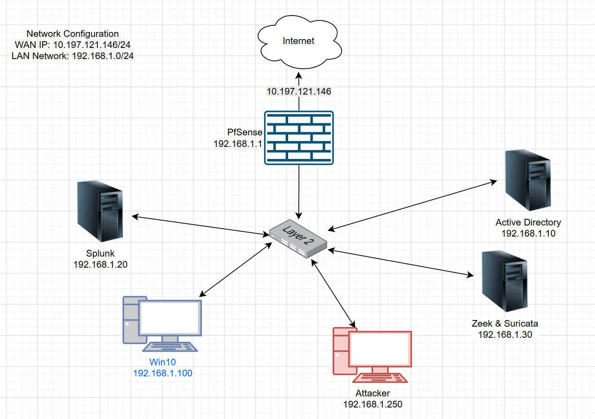

# Detection Lab

A home SOC / detection engineering lab built around pfSense, Active Directory, Windows endpoint telemetry, Splunk, Zeek, Suricata, and an attacker VM.

Note: All IPs shown below are examples and not from real lab enviornment.
## Lab Architecture



## Network Plan

| Component | IP Address | Purpose |
|---|---:|---|
| pfSense WAN | `10.197.121.146/24` | Internet-facing lab gateway |
| pfSense LAN | `192.168.1.1/24` | LAN default gateway |
| Active Directory | `192.168.1.10` | Domain Controller, DNS, authentication logs |
| Splunk | `192.168.1.20` | SIEM/log analytics |
| Windows 10 Endpoint | `192.168.1.100` | Domain-joined victim/workstation |
| Zeek + Suricata | `192.168.1.30` | Network monitoring and IDS |
| Attacker VM | `192.168.1.250` | Controlled testing VM |

## Main Goals

- Build a realistic mini-enterprise network.
- Centralise Windows, AD, firewall, Zeek, and Suricata logs into Splunk.
- Generate controlled security events.
- Write and document detections.
- Store investigation evidence and screenshots in a clean portfolio-ready format.

## Repository Structure

```text
.
├── attack-scenarios/       # Safe detection test cases
├── configs/                # pfSense, Splunk, Windows, Suricata config notes
├── detections/             # SPL, Sigma, Suricata, and Zeek detections
├── docs/                   # Architecture and setup guides
├── evidence/               # Sanitised screenshots, sample logs, timelines
├── scripts/                # Setup and validation scripts
├── SECURITY.md
└── README.md
```

## Setup Order

1. Build the network in VirtualBox/VMware/Proxmox.
2. Configure pfSense LAN and WAN.
3. Configure Active Directory and DNS.
4. Join Windows 10 endpoint to the domain.
5. Install Splunk and create indexes.
6. Install Splunk Universal Forwarder on Windows and AD.
7. Configure Windows Advanced Audit Policy.
8. Deploy Sysmon if required.
9. Install Zeek and Suricata.
10. Forward Zeek and Suricata logs to Splunk.
11. Run controlled test scenarios.
12. Create detections and document evidence.

## Key Detections Included

| Detection | Data Source | File |
|---|---|---|
| Multiple failed Windows logons | Windows Security Event Log | `detections/splunk/windows_failed_logons.spl` |
| Suspicious PowerShell process creation | Windows Event ID 4688 / Sysmon Event ID 1 | `detections/splunk/powershell_process_creation.spl` |
| Suricata IDS alert summary | Suricata `eve.json` | `detections/splunk/suricata_alert_summary.spl` |
| Suspicious DNS activity | Zeek DNS logs | `detections/splunk/zeek_dns_suspicious.spl` |

